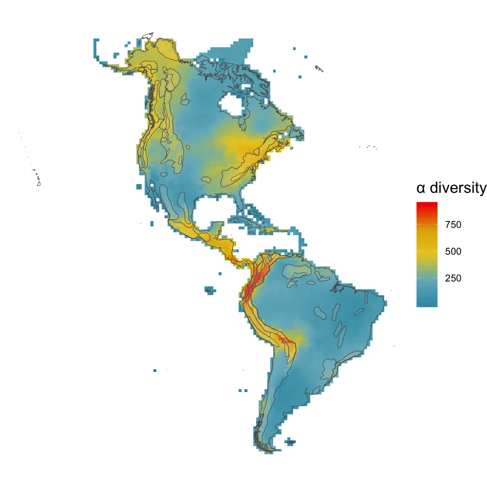

The majority of species follow the latitudinal diversity gradient, meaning they are most diverse near the equator, becoming less so in temperate regions. Bryophytes (mosses, liverworts, hornworts) are a notable exception to this well-established rule, with species richness peaks occurring towards the poles as well as in the tropics (Mateo et. al 2016). The mechanisms behind this unique diversity pattern are still unknown, but one possible explanation is that bryophytes have a high dispersal capacity and are well suited for colder environments, which has allowed them to not only move into temperate regions, but to thrive there as well (Mateo et al 2016). This anomalous diversity pattern is important because developing an understanding of why bryophytes don’t comply with the LDG will help us better understand the mechanisms behind this large scale diversity pattern. In addition, bryophytes are an important carbon sink and our findings on the nature of their diversity will help better inform conservation practices in order to maximize protection, especially in the face of climate change. 
As an extension of the work done by Carter Powell '20, who mapped alpha diversity of bryophytes in North and South America using species distribution data from BIEN, we calculated and mapped beta diversity of bryophytes in the Western Hemisphere. Our study begins with his resulting alpha diversity map shown below. 

Given these results, we wanted to better understand the extent and nature of bryophyte diversity in the Americas in regards to the anomalous temperate peaks, so we calculated and mapped the beta diversity of those same bryophytes. In order to do so, we used bryophyte presence data from BIEN, which was constructed through species distribution modeling based on occurrence records for 4,802 species. We convert this data to a species-by-cell presence-absence matrix in order to calculate beta diversity using the 'betadiver' function from the *vegan* package. Beta diversity was calculated as the average pairwise beta diversity of a focal cell and its 7 or 8 neighbors. Outlier values (over 0.5) were mapped in dark gray to prevent the stretching of the color gradient. The resulting beta diversity maps of bryophytes in the Americas is shown below. Our methods were adopted from McFadden et al. (2019), who calculated and mapped the beta diversity of angiosperms in the Americas. 

Our research shows that despite having high levels of species richness in North American temperate regions, there is less species turnover among bryophytes in those regions. This unexpected result means we need to go even further in our examination of bryophyte beta diversity in the Americas by looking at their phylogenetic diversity. We have already run phylogenetic analyses for 275 species of moss, out of 3339 species total, by calculating Faith's Phylogenetic Diversity using a phylogenetic tree from Laenen et al. (2018). While this was helpful in getting a preliminary look at the phylogenetic diversity of bryophytes in the Americas, we are interested in running a more comprehensive analysis of these patterns. In order to do so, we need to construct a phylogeny that incorporates significantly more species or our analyses will only give us a fragmented look at bryophyte phylogenetic diversity. Shown below is our preliminary map of bryophyte phylogenetic diversity in the Americas. 

**References**

Laenen, B., Patiño, J., Hagborg, A., Désamoré, A., Wang, J., Shawf, A. J., Goffinet, B., and Vanderpoorten, A. 2018. Evolutionary origin of the latitudinal diversity gradient in liverworts. Molecular Phylogenetics and Evolution. 127:606-612.

Mateo, R. G., Broennimann, O., Normand, S., Petitpierre, B., Araújo, M. B., Svenning, J. C., Baselga, A., Fernández-González, F., Gómez-Rubio, V., Muñoz, J., Suarez, G. M., Luoto, M., Guisan, A. and Vanderpoorten, A. 2016. The mossy north: an inverse latitudinal diversity gradient in European bryophytes. Scientific Reports. 6:25546.

McFadden, I. R., Sandel, B. , Tsirogiannis, C. , Morueta‐Holme, N. , Svenning, J. , Enquist, B. J. and Kraft, N. J. (2019), Temperature shapes opposing latitudinal gradients of plant taxonomic and phylogenetic $\beta$ diversity. Ecol Lett, 22: 1126-1135. doi:10.1111/ele.13269

